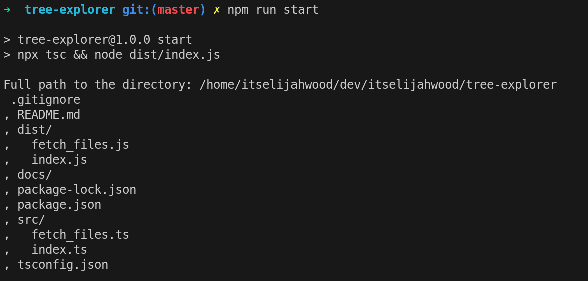

# Tree Explorer

Tree Explorer is a tree viewer designed in typescript to show your directory in a nice way.

</img>

## Install 

Install [**nodejs**](https://nodejs.org/en) and [**npm**](https://www.npmjs.com/)

Install the required dependencies needed for the project
```bash
npm i
```

## Run

Once you have followed the install setup, compile and run the files
```bash
npm run start
```